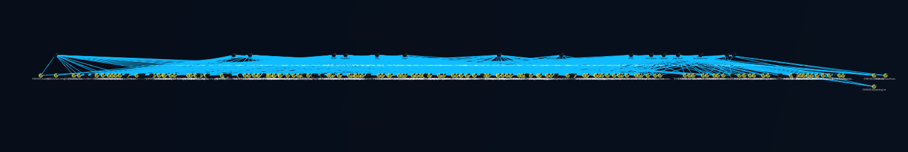
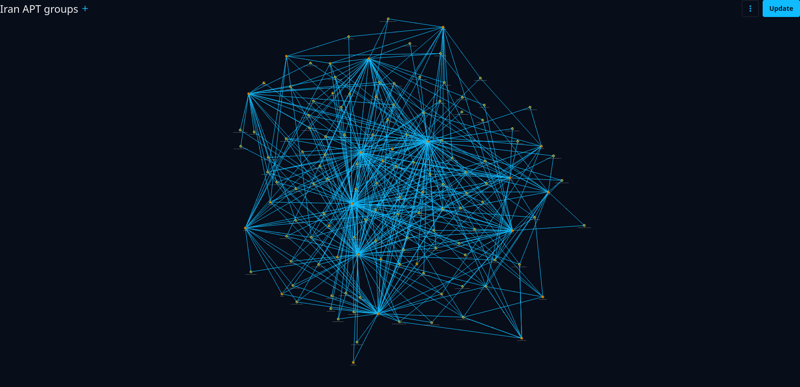

# Iranian APT Analysis (OpenCTI Project)

## Overview

This project analyzes Iranian Advanced Persistent Threat (APT) groups using MITRE ATT&CK mappings and OpenCTI graph modeling.

It focuses on identifying shared tactics, techniques, and procedures (TTPs) across multiple threat actors and visualizing relationships between them.

Iranian threat actors are known for cyber espionage, credential attacks, and social engineering campaigns, with increasing sophistication over the past decade. ([Picus Security][1])

---

## 🧠 Objectives

* Map APT groups to MITRE ATT&CK techniques
* Identify overlaps in adversary tradecraft
* Visualize relationships between threat actors
* Support CTI research and analysis

---

## 🌐 Network Visualization

### 🔗 Full Relationship Graph



This graph shows relationships between APT groups based on shared techniques.

---

### 🧩 APT Cluster View



Clusters highlight groups with stronger overlaps in behavior and tradecraft.

---

## ⚙️ Methodology

* Data derived from MITRE ATT&CK and public CTI sources
* Relationships created when **≥2 shared techniques**
* Graph generated using OpenCTI
* Focus on **behavioral similarity**, not attribution

Iranian APT groups often rely heavily on phishing, credential access, and command execution techniques as part of their operations. ([Medium][2])

---

## ⚠️ Disclaimer

This project represents **shared tradecraft**, not confirmed collaboration between threat actors.

Connections indicate:

* Similar techniques
* Overlapping behavior
* Comparable operational patterns

They do **NOT** imply direct coordination.

---

## 📂 Repository Structure

```
IranApt/
├── graphs/
│   ├── iran_apt_network.png
│   ├── iran_apt_clusters.png
│
├── data/
│   └── dataset.json
```

---

## 📥 Import into OpenCTI

To use this dataset:

1. Open OpenCTI
2. Go to **Data → Import**
3. Upload `dataset.json` (STIX format recommended)

Alternatively, use CSV files for custom ingestion.

---

## 🧪 Example Use Cases

* Threat intelligence research
* Adversary clustering
* Detection engineering
* Academic cybersecurity studies

---

## 📚 References

* MITRE ATT&CK Framework
* Public CTI reports on Iranian threat actors
* Open-source intelligence datasets

---

## 🚀 Future Work

* Add weighted relationships (strong vs weak links)
* Expand to other nation-state APT groups
* Automate clustering and scoring

---

## 👤 Author

VicArr786

